<p align="center">
  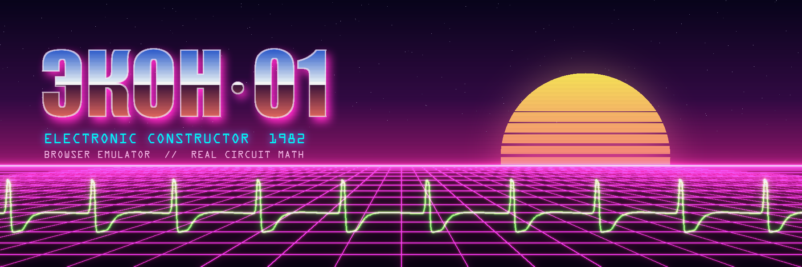
</p>

<p align="center">
  <code>▶ 12 FACTORY DEVICES</code>&nbsp;
  <code>▶ 26 MODULE TYPES</code>&nbsp;
  <code>▶ 5 TRANSISTORS OF BUILT-IN AMP</code>&nbsp;
  <code>▶ 110 TESTS</code>&nbsp;
  <code>▶ 0 RECORDED SOUNDS</code>
</p>

```text
 ВНИИ «ЭЛЕКТРОНСТАНДАРТ» · ГАТЧИНСКИЙ ОПЫТНЫЙ ЗАВОД · АРТ. ЛО-085-01-2141 · ЦЕНА 15 РУБ.

 ЭКОН-01 EMULATOR  v0.1                                   8.7 V  ▮▮▮▮▮▮▮▮▮▯  OK
 ──────────────────────────────────────────────────────────────────────────────────
 > LOAD MANUAL  econ01_manual.djvu ........ 53 PAGES ............................ OK
 > LOAD MODULES block_spec.json ........... 26 TYPES, 36 CUBES, PINOUTS CONFIRMED  OK
 > LOAD PANEL   XT1..XT7, TOP STRIP ....... TRACED FROM MOUNTING DRAWINGS ........ OK
 > SOLVER       MNA + NEWTON + EBERS-MOLL + TWO CLOCKS FOR RF ..................... OK
 > AUDIO        AUDIOWORKLET, 48 kHz ......................................... READY.

 PRESS ▶ TO BUILD A CIRCUIT
```

A browser emulator of **«Электронный конструктор ЭКОН-01»**, a Soviet solderless electronics kit
for 10–15 year olds (Gatchina, 1982 → early '90s). Snap the yellow cubes into the field, turn them,
press the key, and **the circuit is actually solved**: node by node, transistor by transistor,
thousands of times a second. Nothing you hear was recorded. A siren sweeps because a 20 µF
capacitor charges in the emitter of a real multivibrator, and a time relay hums because an
oscillator at 294 kHz keeps choking itself.

> **Status:** a work in progress, and an honest one. Every claim about the hardware is tagged
> **[C]**onfirmed, **[I]**nferred or **[G]**uessed in [`SPEC.md`](SPEC.md); what still does not work
> is written down in [`UNSOLVED.md`](UNSOLVED.md).

---

## ▓▒░ TRACK LIST

| Side A: The machine | Side B: How it was done |
|---|---|
| [A1 · The device](#a1--the-device) | [B1 · Reverse engineering, human in the loop](#b1--reverse-engineering-human-in-the-loop) |
| [A2 · See it run](#a2--see-it-run) | [B2 · Circuit math in real time](#b2--circuit-math-in-real-time) |
| [A3 · Oscilloscope party](#a3--oscilloscope-party) | [B3 · Power meter: the token budget](#b3--power-meter-the-token-budget) |
| [A4 · Presets](#a4--presets) | [B4 · Known glitches](#b4--known-glitches) |
| [A5 · Quick start](#a5--quick-start) | [B5 · Repository map and sources](#b5--repository-map-and-sources) |

---

## A1 · The device

<p align="center">
  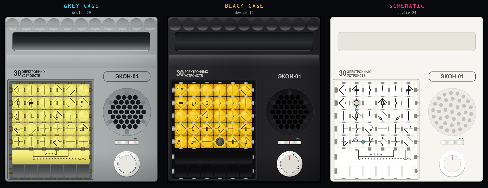
</p>

ЭКОН-01 is a portrait case, **190 × 206 × 38 mm**, running from six А316 cells (**8.7 V**). On the
left is an assembly field of **36 cube cells**: a 6 × 5 grid, a full-width slot for the ferrite
antenna bar, and a bottom row. On the right sit a loudspeaker, a volume thumbwheel that doubles
as the power switch, and a tuning knob for the built-in variable capacitor C10. Inside the case is
a five-transistor amplifier (КТ315Б ×2, МП26А, МП38, МП42Б). The kit shipped with 36 modules and a
manual of **30 devices**: amplifiers, multivibrators, a siren, a Morse trainer, receivers, a baby
monitor, a metronome and a pocket transmitter.

There are no wires. **Every module is a hollow cube with one contact on each side face**, and two
cubes connect only where their faces touch:

```text
            N                    ┌───────┬───────┬───────┐
        ┌───●───┐                │  ─┤├─ │  ─┬─  │ ─▯▯─  │   same module, turned 90°,
        │  ─▯▯─ │                │       │   │   │       │   is a different circuit:
      W ●  68k  ● E    ◄─ pads ─► ●───────●───────●───────●   rotation is a permutation
        │   o   │                │  ─▯▯─ │  ─┼─  │  ─┤├─ │   N→E→S→W of the four pins
        └───●───┘                │       │   │   │       │
            S                    └───────┴───────┴───────┘
   a ring "o" tells look-alike      contacts on the right edge are the panel
   modules apart (68k vs 2.2k)       terminals XT1…XT7; the top edge is one strip
```

The manual insists that a module must sit *«не только на своем месте, но и в таком положении,
в каком он изображён на монтажном рисунке»*, not only in its place but turned as drawn. The
emulator ships three skins: the grey and black production cases, colour-sampled from photographs
([how](#the-evidence-on-the-bench)), and a flat schematic view.

---

## A2 · See it run

### Device 24 «Реле времени» (Time relay)

<p align="center">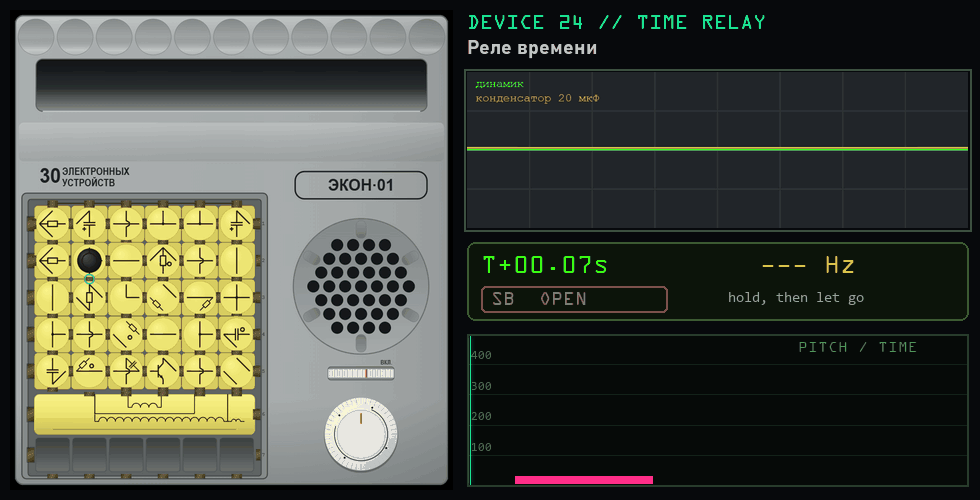</p>

Holding the key charges a 20 µF capacitor through 68 kΩ. That capacitor feeds the base of an
oscillator built on the **magnetic antenna**. The oscillator does not hum at its 294 kHz: it
**squegs**. Each burst of radio frequency pumps its own base below cut-off, the base recovers
through the capacitor, and the next burst fires. What reaches the loudspeaker is the burst rate.

In the GIF the tone appears on the press, climbs from about 50 Hz to 410 Hz as the capacitor
charges, and keeps sounding after release, drifting down as the charge leaks through 1.36 MΩ.
That is the "relay". CH2 on the scope is the capacitor itself.

<p align="center">🔊 <a href="https://cdn.jsdelivr.net/gh/dmitryaleks/Econ-01-emulator@main/docs/readme/audio/d24_relay.wav"><b>LISTEN</b> · the same run as the GIF</a> <sub>(11 s WAV)</sub></p>

### Device 12 «Сирена» (Siren)

<p align="center">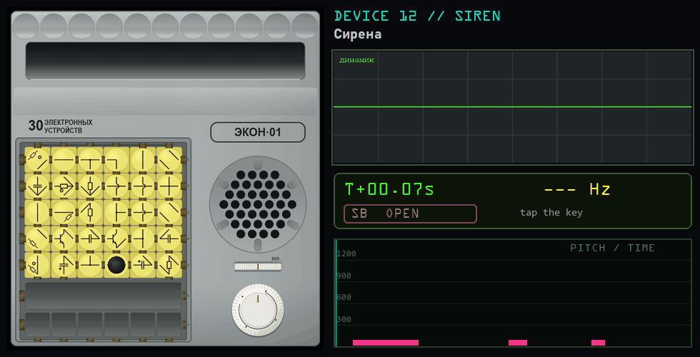</p>

A classic astable multivibrator with 20 µF in the left transistor's emitter, which the key shorts.
**Held:** a steady 400 Hz. **Let go:** the emitter capacitor charges, the pitch shoots up to about
1.4 kHz, then falls away as the transistor starves, silent within a second and a half. Tap the key
and you have a siren: *«нажимая и отпуская кнопку, можно приближенно имитировать сигнал сирены»*.

<p align="center">🔊 <a href="https://cdn.jsdelivr.net/gh/dmitryaleks/Econ-01-emulator@main/docs/readme/audio/d12_siren.wav"><b>LISTEN</b> · the same three presses as the GIF</a> <sub>(11 s WAV)</sub></p>

> Both GIFs are rendered frame by frame from the emulator's own panel and scope renderers, and
> its own solver, at 12 kHz. The side column is added telemetry: time, key state, and the pitch
> measured from the loudspeaker signal.
>
> **About the sound samples.** They are approximate by nature. Each one is the emulator's
> loudspeaker signal, solved offline at 48 kHz with the same key presses, sent through the
> browser's own output stage (a tanh soft clip), peak-normalised and saved as 24 kHz WAV. The real
> kit's 0,5ГДШ-2 loudspeaker, its plastic case and a tiring battery are not modelled. GitHub
> can't play audio inline, and its file pages don't open WAVs, so each 🔊 link opens the file from
> [`docs/readme/audio/`](docs/readme/audio/) through the jsDelivr CDN, straight into the browser's
> own player.

---

## A3 · Oscilloscope party

Clip up to two probes onto any contact and the scope shows real node voltages. Six presets,
probed where it gets interesting, each with what it sounds like:

<table>
<tr>
<td width="50%" valign="top">
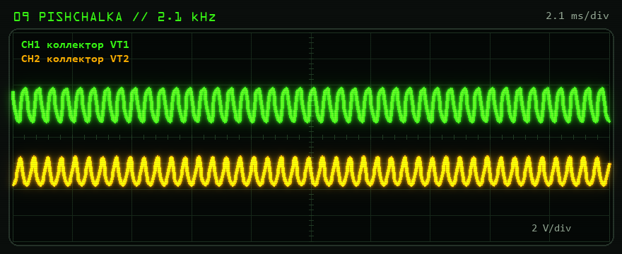<br>
<b>09 «Пищалка»</b>: two amplifying stages in a loop, rounded and phase-shifted.<br>
🔊 <a href="https://cdn.jsdelivr.net/gh/dmitryaleks/Econ-01-emulator@main/docs/readme/audio/d09_pishchalka.wav"><b>LISTEN</b></a> · the key sends <code>··· ─── ···</code>
</td>
<td width="50%" valign="top">
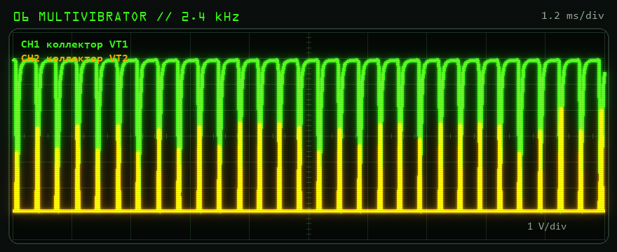<br>
<b>06 «Мультивибратор»</b>: textbook cross-coupled switches, a 27 µs pulse and a long pause.<br>
🔊 <a href="https://cdn.jsdelivr.net/gh/dmitryaleks/Econ-01-emulator@main/docs/readme/audio/d06_multivibrator.wav"><b>LISTEN</b></a> · two presses of the key
</td>
</tr>
<tr>
<td width="50%" valign="top">
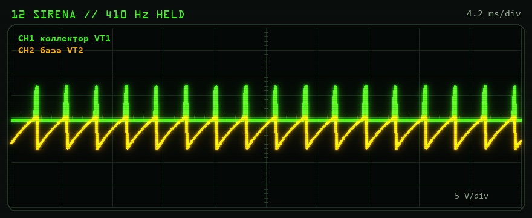<br>
<b>12 «Сирена»</b>: the base of VT2 recharging from the −6.5 V its partner kicks it to, where
the emitter-base junction breaks down, as on the real part.<br>
🔊 <a href="https://cdn.jsdelivr.net/gh/dmitryaleks/Econ-01-emulator@main/docs/readme/audio/d12_siren.wav"><b>LISTEN</b></a> · hold, then three sweeps
</td>
<td width="50%" valign="top">
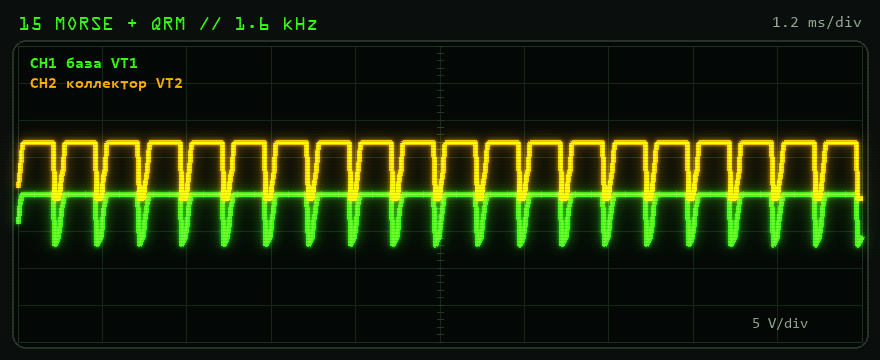<br>
<b>15 Морзе с помехами</b>: a pulse only 18 µs wide, shorter than one audio sample, which the
solver has to catch anyway.<br>
🔊 <a href="https://cdn.jsdelivr.net/gh/dmitryaleks/Econ-01-emulator@main/docs/readme/audio/d15_morse_qrm.wav"><b>LISTEN</b></a> · <code>─·─· ──·─</code> (CQ) through the whistle
</td>
</tr>
<tr>
<td width="50%" valign="top">
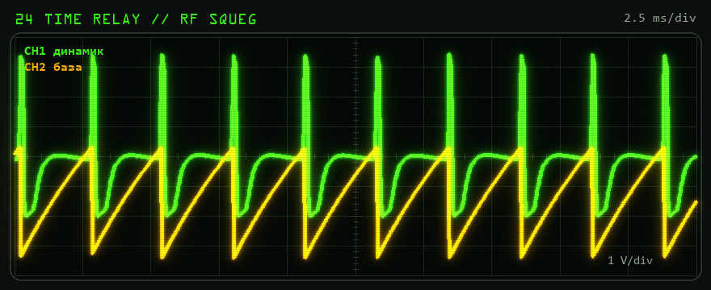<br>
<b>24 Реле времени</b>: every spike is a radio-frequency burst, and every ramp is the base
recovering before the next one.<br>
🔊 <a href="https://cdn.jsdelivr.net/gh/dmitryaleks/Econ-01-emulator@main/docs/readme/audio/d24_relay.wav"><b>LISTEN</b></a> · press, hold, let go
</td>
<td width="50%" valign="top">
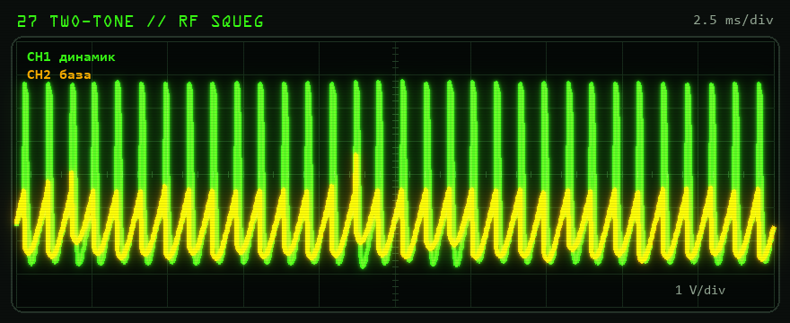<br>
<b>27 Двухтональный генератор</b>: the same squegging, retuned by the key from 1.28 to
1.10 kHz.<br>
🔊 <a href="https://cdn.jsdelivr.net/gh/dmitryaleks/Econ-01-emulator@main/docs/readme/audio/d27_two_tone.wav"><b>LISTEN</b></a> · key up, down, up, down
</td>
</tr>
</table>

Plot one channel against the other and the same recordings turn into figures. (The in-app scope
is time-based; these X–Y screens are drawn from its recorded traces.) The third screen goes deeper:
it is the 413 kHz tank of device 29 spiralling outward inside a single burst, voltage against
current, from a brute-force reference simulation.

<p align="center">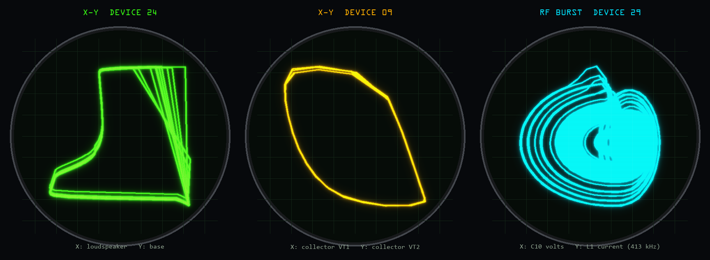</p>

---

## A4 · Presets

Each factory preset is the manual's **mounting drawing transcribed cell by cell**: all 30 cells,
spares included, turned as drawn. Its netlist is checked against the printed schematic by a test.

| # | Device | What you get | Listen | Solver |
|---|---|---|---|---|
| 6 | Мультивибратор | tone while the key is held, 2.4 kHz | [🔊](https://cdn.jsdelivr.net/gh/dmitryaleks/Econ-01-emulator@main/docs/readme/audio/d06_multivibrator.wav) | ✅ correct; slower than real time in the browser |
| 8 | Мультивибратор с низкой частотой | a click every ~1 s | [🔊](https://cdn.jsdelivr.net/gh/dmitryaleks/Econ-01-emulator@main/docs/readme/audio/d08_slow_multivibrator.wav) | ✅ |
| 9 | «Пищалка» | Morse key tone, 2.1 kHz | [🔊](https://cdn.jsdelivr.net/gh/dmitryaleks/Econ-01-emulator@main/docs/readme/audio/d09_pishchalka.wav) | ✅ |
| 12 | «Сирена» | steady 400 Hz, sweep on release | [🔊](https://cdn.jsdelivr.net/gh/dmitryaleks/Econ-01-emulator@main/docs/readme/audio/d12_siren.wav) | ✅ |
| 13 | Звуковой генератор | 400 Hz test tone (output wires described, not placed) | [🔊](https://cdn.jsdelivr.net/gh/dmitryaleks/Econ-01-emulator@main/docs/readme/audio/d13_sound_generator.wav) | ✅ |
| 15 | Генератор для азбуки Морзе с помехами | 1.6 kHz "interference", 570 Hz while keyed | [🔊](https://cdn.jsdelivr.net/gh/dmitryaleks/Econ-01-emulator@main/docs/readme/audio/d15_morse_qrm.wav) | ✅ correct; ~50 % real time in the browser |
| 24 | Реле времени | tone after a press that outlives the press | [🔊](https://cdn.jsdelivr.net/gh/dmitryaleks/Econ-01-emulator@main/docs/readme/audio/d24_relay.wav) | ✅ RF squegging |
| 26 | «Электронная няня» | moisture alarm on the antenna oscillator | — | ⚠️ probe not modelled |
| 27 | Двухтональный генератор (+ the manual's other-tones variant) | 1.28 / 1.10 kHz | [🔊](https://cdn.jsdelivr.net/gh/dmitryaleks/Econ-01-emulator@main/docs/readme/audio/d27_two_tone.wav) | ✅ RF squegging |
| 28 | Генератор сигналов | ~1.1 kHz squeg, a long-wave "transmitter" | [🔊](https://cdn.jsdelivr.net/gh/dmitryaleks/Econ-01-emulator@main/docs/readme/audio/d28_signal_generator.wav) | ✅ RF squegging |
| 29 | «Метроном» | ~12 ticks a second | [🔊](https://cdn.jsdelivr.net/gh/dmitryaleks/Econ-01-emulator@main/docs/readme/audio/d29_metronome.wav) | ✅ at ≥ 24 kHz; see [B4](#b4--known-glitches) |
| 30 | «Морзянка» | keyed transmitter | [🔊](https://cdn.jsdelivr.net/gh/dmitryaleks/Econ-01-emulator@main/docs/readme/audio/d30_morse_transmitter.wav) | ✅ RF squegging |
| — | Детекторный приёмник | tune the knob to fictional stations | [🔊](https://cdn.jsdelivr.net/gh/dmitryaleks/Econ-01-emulator@main/docs/readme/audio/detector_receiver.wav) | ✅ reconstruction, not from the manual |

---

## A5 · Quick start

```bash
npm install
npm run dev        # http://localhost:5173 — pick a preset, press «Включить звук»
npm test           # vitest: solver, netlists, presets vs schematics, timing
npm run build      # type-check and bundle to dist/
```

**Drag** a module from the bin onto the field. **Click**, right-click or press **R** to turn it,
and **Alt+click** to pull it. **Click a contact** to clip a probe. **Press the кнопка** by its black
cap. **Free-play mode** lifts the kit's module counts.

---

## B1 · Reverse engineering, human in the loop

There was no schematic capture, no netlist and no emulator to start from. The sources were a
scanned 1986 manual, a handful of photographs, and a person who could look at a zoomed-in
blotch and tell a marker ring from a speck of scan dust. The work ran as a loop between a model
that does the tedious, checkable parts and a human who decides what the evidence says.

### The evidence on the bench

**A device page** gives two drawings: the schematic, and a mounting drawing of the whole field
showing which cube goes where and which way it faces. Device 6 «Мультивибратор» (page 15) was the
first one traced:

<table>
<tr>
<td width="42%" valign="top">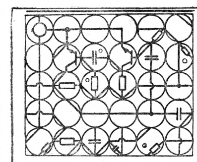</td>
<td width="58%" valign="top">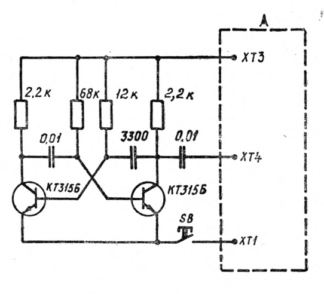</td>
</tr>
<tr>
<td valign="top"><sub><code>assets/multivibrator-chart.png</code>: the mounting drawing. Every cube and its turn has to be read from this.</sub></td>
<td valign="top"><sub><code>assets/multivibrator-schematics-raw.png</code>: the schematic it must reproduce. The dashed box «А» is the kit's built-in amplifier, seen only through its terminals XT1, XT3 and XT4.</sub></td>
</tr>
</table>

**Приложение 3: inside the dashed box.** Every one of the 30 schematics hides the amplifier behind
that box «А». The appendix opens it:

<p align="center">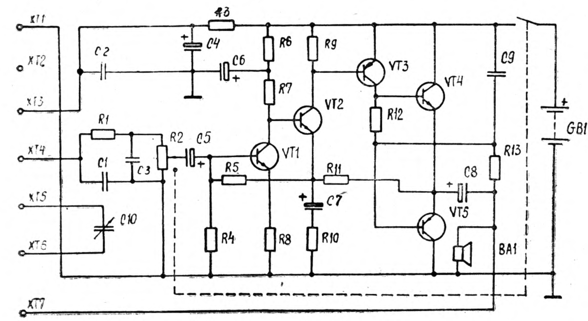</p>

[`assets/core/core-schematics.png`](assets/core/core-schematics.png), with its parts list in
[`assets/core/core-elements-registry.png`](assets/core/core-elements-registry.png), is transcribed
transistor by transistor into `addBuiltIn` in [`src/netlist/build.ts`](src/netlist/build.ts):

- **the power path:** GB1 and the switch ganged with the volume control R2, then R3 with C4 and C2
  feeding XT3;
- **the input:** XT4 → R1 → R2's wiper, with C1 and C3 shunting radio frequencies;
- **the transistors:** VT1 and VT2 (КТ315Б), the МП26А driver VT3, and the МП38/МП42Б
  complementary pair VT4/VT5;
- **the output:** C8 into the 0,5ГДШ-2 loudspeaker on XT7, and C10 across XT5–XT6.

Nothing about the amplifier is scripted. Three numbers nobody fitted check the transcription:

- The output midpoint sits at **4.6 V**, half the 8.7 V rail, as a single-supply push-pull stage should.
- It idles at **6.5 mA**.
- Driven to clipping it draws **~130 mA**, against the manual's rated maximum of 120 mA.

This page also fixes the terminal names every device page uses.

**Приложение 1: the symbol legend.** The manual's own key to its drawings, and the reference for
reading module icons: which end of a diode is the anode, and which transistor leg is Б (base),
К (collector) and Э (emitter).

<details>
<summary>▶ Show the legend (<code>assets/circuitry-legend/</code>, three scans)</summary>
<br>
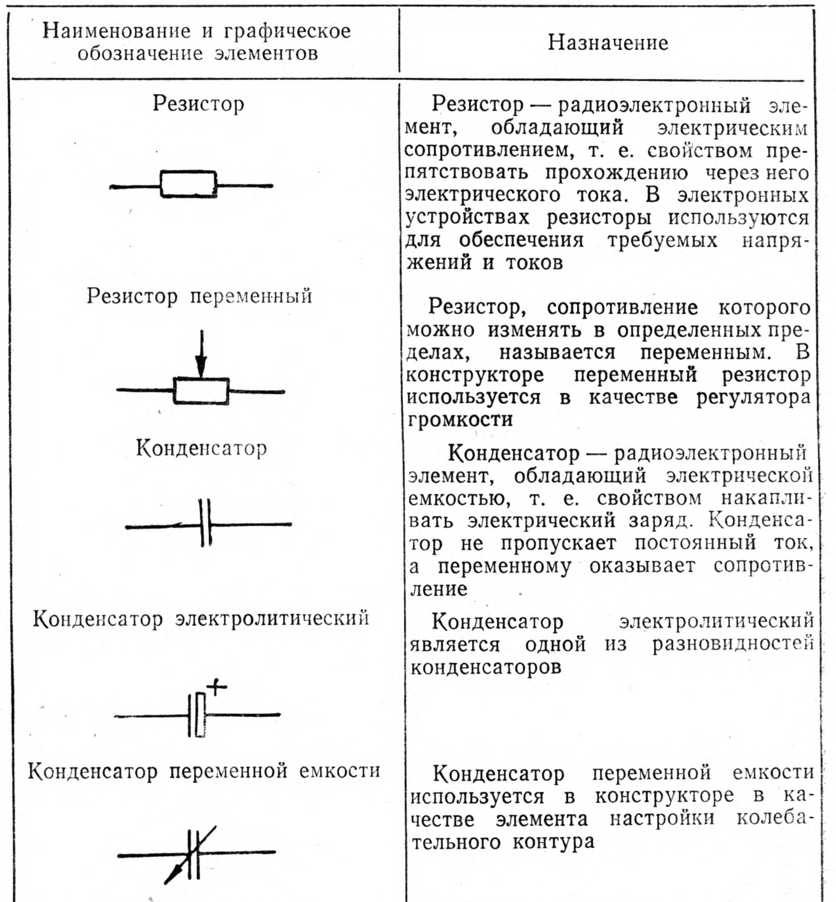
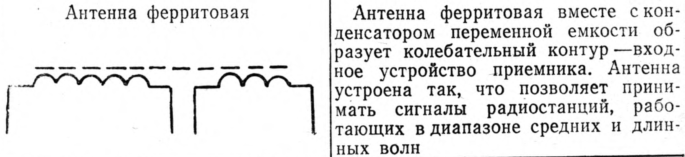
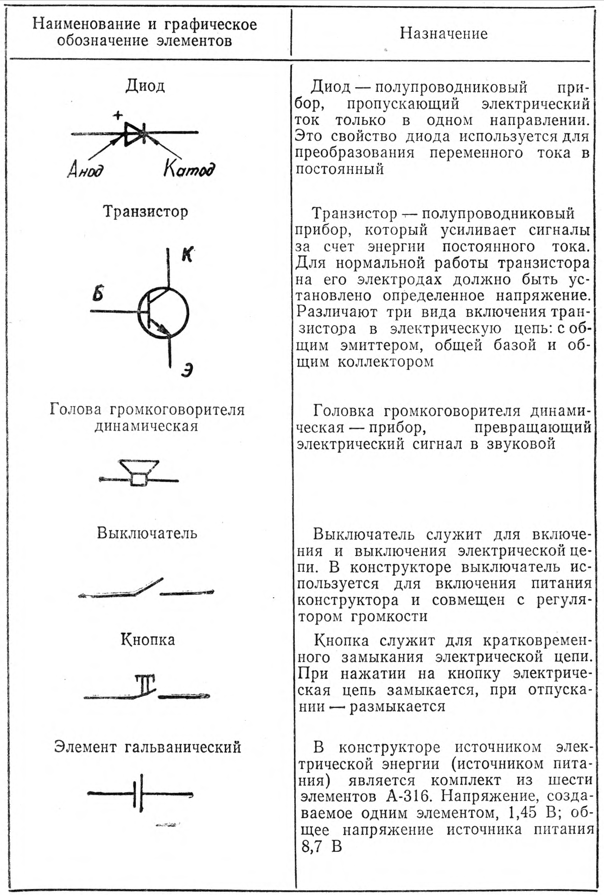
</details>

**One square-on photograph** of a grey-cased unit
([`assets/the-original-econ-01-body.jpg`](assets/the-original-econ-01-body.jpg)):

- **Orientation:** the case is 1.09 times taller than wide, which settles which of the manual's
  "206 × 190 mm" is height.
- **Geometry:** the field origin, the 16.2 mm cell pitch and the size of the antenna slot.
- **Mouldings:** the dimpled carry rail, the boxed badge and the hex speaker grille.
- **The palette:** every colour of the grey skin is sampled from it.

<p align="center">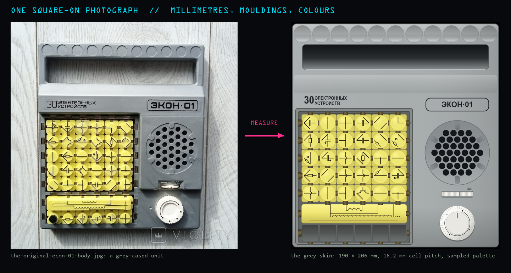</p>

### The loop

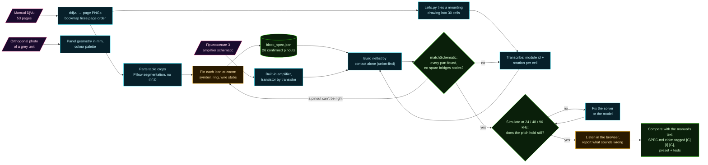
```mermaid
flowchart LR
    classDef src fill:#1a0b2e,stroke:#ff2e88,color:#ffd6ec
    classDef ai fill:#07202a,stroke:#00e5ff,color:#c9f7ff
    classDef human fill:#2a1a00,stroke:#ffb000,color:#ffe7b0
    classDef gate fill:#0a1f0a,stroke:#39ff14,color:#d7ffd0

    M[/"Manual DjVu<br/>53 pages"/]:::src --> X["ddjvu → page PNGs<br/>bookmap fixes page order"]:::ai
    P[/"Orthogonal photo<br/>of a grey unit"/]:::src --> G["Panel geometry in mm,<br/>colour palette"]:::ai
    A3[/"Приложение 3<br/>amplifier schematic"/]:::src --> AMP["Built-in amplifier,<br/>transistor by transistor"]:::ai
    X --> T["Parts table crops<br/>Pillow segmentation, no OCR"]:::ai
    T --> R["Pin each icon at zoom:<br/>symbol, ring, wire stubs"]:::human
    R --> B[("block_spec.json<br/>26 confirmed pinouts")]:::gate
    X --> C["cells.py tiles a mounting<br/>drawing into 30 cells"]:::ai
    C --> L["Transcribe: module id +<br/>rotation per cell"]:::ai
    L --> N["Build netlist by<br/>contact alone (union-find)"]:::ai
    B --> N
    AMP --> N
    N --> S{"matchSchematic:<br/>every part found,<br/>no spare bridges nodes?"}:::gate
    S -- no --> L
    S -- "a pinout can't be right" --> R
    S -- yes --> V{"Simulate at 24 / 48 / 96 kHz:<br/>does the pitch hold still?"}:::gate
    V -- no --> F["Fix the solver<br/>or the model"]:::ai
    F --> V
    V -- yes --> H["Listen in the browser,<br/>report what sounds wrong"]:::human
    H --> D["Compare with the manual's text;<br/>SPEC.md claim tagged [C] [I] [G],<br/>preset + tests"]:::gate
```

<p align="center">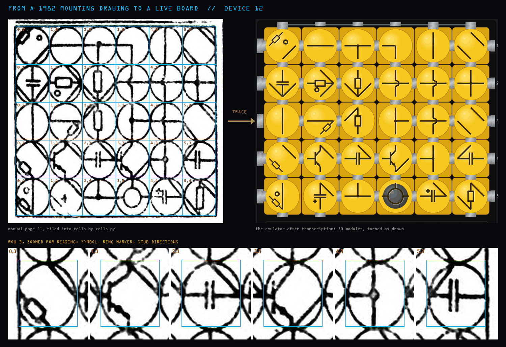</p>

### Pinning the module registry

[`assets/blocks/block_spec.json`](assets/blocks/block_spec.json) is the single source of truth
for what each of the 26 module types is and how it is wired; `src/model/catalogue.ts`, the panel
symbols and the netlist are all built from it. Its pinouts could not simply be read off the page.

- **The icons are tiny.** Each module is a ~150 px icon in the manual's parts table (Приложение 2),
  printed small and scanned soft.
- **The scan is botched in places.** The two diode arrows on the twin-diode module are ink
  stars, the two transistors are near-identical smudges, and one capacitor sits under an ink blot.
- **Guessing had already failed.** An earlier catalogue written from those guesses had one
  transistor's collector and emitter swapped, and missed spare wires on many modules.

So every pinout was pinned by a person:

<p align="center">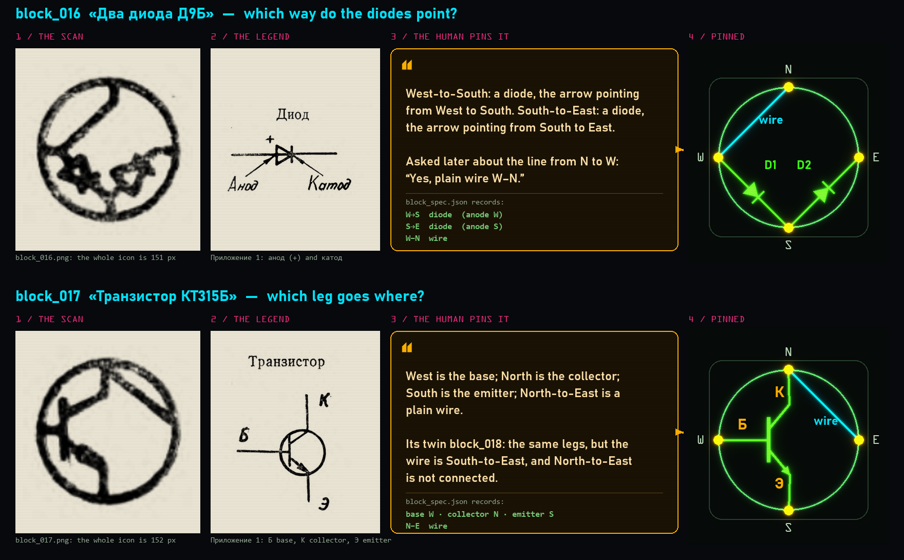</p>

**How the registry was solidified:**

1. **Crop and transcribe.** Pillow finds each row of the parts table and crops the icon and its
   description. No OCR engine was used: the model reads the Russian text from enlarged crops and
   records values, series, tolerances and kit counts.
2. **The human pins the hard ones.** Pinouts are given in face terms, in the icon's own
   orientation. For block_016: *"West-to-South edge has a diode with arrow pointing West-to-South;
   South-to-East has a diode with the arrow pointing South-to-East."* Blocks 003, 016, 017 and 018
   went in this way.
3. **The model asks about the rest.** The human's instruction was *"Ask me to disambiguate
   pinouts and other properties of blocks where you are unsure"*.
   - The model enlarged every remaining icon 3–5× with N/E/S/W labels and wrote down its as-drawn
     reading.
   - It asked about four modules per round. The as-drawn reading was the first option, the old
     catalogue's version the second, and each question described what the icon shows.
   - Six rounds covered the kit.
4. **Recorded as confirmed.** Each module gets `status: "confirmed"` and `source: "user"`, one
   connection per element, with polarity as `from` → `to` (anode → cathode, + → −). Its `notes`
   keep what the icon shows, how it differs from the old catalogue, and any scan damage.
5. **The circuits audit the registry.** A pinout is only as good as the layouts it explains. When
   device 24's mounting drawing matched its schematic everywhere except at the кнопка, the model
   stopped, laid out both readings and asked, and the registry changed.
6. **The recipe is kept.** [`how_to_process_raw_blocks.md`](assets/blocks/how_to_process_raw_blocks.md)
   records every step, so the next table goes through the same process.

**A pin in the history.** block_016 was confirmed twice, a round apart. The enlarged icon showed
a line the first ruling had not mentioned, so the model asked about it instead of guessing. The
diff between `17004e1` and `c95ca2b`:

```diff
 "pinout": {
   "status": "confirmed",
   "connections": [
     { "from": "W", "to": "S", "via": "diode", "symmetric": false },
     { "from": "S", "to": "E", "via": "diode", "symmetric": false },
+    { "from": "W", "to": "N", "via": "wire" }
   ],
   "source": "user"
 },
-"notes": "… The icon also has a line from the W side up to the top rim that the confirmed pinout
-         doesn't include; it may be a plain W–N wire like block_003's, still to check."
+"notes": "… a plain W–N wire makes the first anode reachable on both W and N.
+         catalogue.ts:dd9b has the two diodes but not the W–N wire."
```

**Rulings that needed a human:**

| Module or question | What the scan showed | What was ruled |
|---|---|---|
| block_016, two Д9Б diodes | two star-shaped blots, and a line from N down to W | diodes W→S and S→E; *"Yes, plain wire W–N"* |
| block_017 and block_018, КТ315Б | two near-identical smudged transistors | base W, collector N, emitter S on both. The extra wire is N–E on 017 and S–E on 018; the old catalogue had 018's collector and emitter swapped |
| block_010, 680 pF | crossing wires, no capacitor plates anywhere, an ink blot over the N–E chord | *"Crossing wires + cap N–E"*: the capacitor sits under the blot |
| block_022 «Щель» | two chords that don't meet | *"Two corner links"*. The spec and catalogue had it as a blank |
| block_019, the antenna bar | leads along the top of a six-cell bar | typed in by the human: *"The element L1 touches pin East and touches North pins number two, five, six. Internal element L2 touches just North pins three and four"*. The model read the winding order back, and it was confirmed |
| rings on 003, 004, 006, 012 | a small ring, on 003 hanging from a stem | *"Not sure"*. Recorded as a marker; comparing the table showed each ring tells a module from one wired the same with a different value (68 kΩ vs 2.2 kΩ, 0.01 µF vs 3300 pF) |
| block_026, the кнопка | a cap with stubs at W, E and S | first *"Press joins W, E and S"*. After device 24's layout contradicted it: *"W–E always joined, S switched"* |
| XT1–XT7, the panel terminals | nothing on any drawing | *"You'll need to iterate over multiple schematics to reverse engineer those panel terminal positions. Look at the Device number 26 for example."* Answered by tracing layouts, not by asking |

**Who did what:**

| The human (the kit's owner) | The model (Claude Code) |
|---|---|
| Chose the goals, the order of devices, and when to commit | Extracted the manual, cropped and tiled every table and drawing |
| Exported the parts-table scans; dictated the hardest pinouts and settled six rounds of pinout questions | Transcribed 30-cell layouts and wrote the netlist builder, schematic matcher and tests |
| Played the result and reported what was off: a scope that moved with no sound behind it, click sounds that came out muffled and overdriven | Diagnosed and fixed it: a worklet running 8× slower than real time, an overdriven click synth |
| Answered clarifying questions and settled design calls | Wrote the solver, and documented dead ends in `DEVPLAN.md` and `UNSOLVED.md` |

**Rules that kept it honest:**

- **Wiring is read from contact alone.** A layout is traced as physics sees it, never "as it
  was probably meant". The schematic comparison is a search that must place every printed part
  on a distinct module and let no spare module bridge two nodes. Spares are expected: the factory
  fills all 30 cells to fit what is in the box.
- **Evidence beats the first reading.** The кнопка correction above then explained a cryptic
  *«развернуть на 180°»* on device 27's page.
- **The panel map came from the drawings.** Tracing devices 6 and 26 showed the terminals
  XT1–XT7 are the right-edge contacts, that the top edge is one strip, and that the left edge is
  only clip points. The first model had them on the wrong side.
- **Every claim gets a tag.** **[C]** means a scan or photograph shows it, **[I]** that it follows
  from those, **[G]** that it is a guess (β = 80, core Q = 150, coupling k = 0.8). Mismatches are
  written down, not smoothed over: device 8 clicks every 1.06 s against the manual's "several
  seconds", and the metronome's tuning range is wider than *«в небольших пределах»*.

---

## B2 · Circuit math in real time

### The signal path

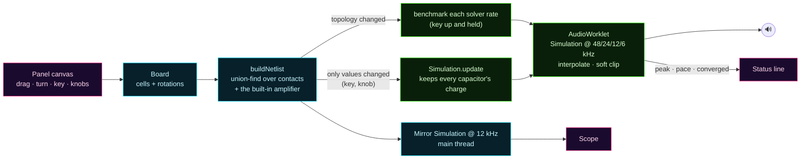
```mermaid
flowchart LR
    classDef ui fill:#1a0b2e,stroke:#ff2e88,color:#ffd6ec
    classDef core fill:#07202a,stroke:#00e5ff,color:#c9f7ff
    classDef audio fill:#0a1f0a,stroke:#39ff14,color:#d7ffd0

    U["Panel canvas<br/>drag · turn · key · knobs"]:::ui --> BD["Board<br/>cells + rotations"]:::core
    BD --> NL["buildNetlist<br/>union-find over contacts<br/>+ the built-in amplifier"]:::core
    NL -- "topology changed" --> BM["benchmark each solver rate<br/>(key up and held)"]:::audio
    BM --> WK["AudioWorklet<br/>Simulation @ 48/24/12/6 kHz<br/>interpolate · soft clip"]:::audio
    NL -- "only values changed<br/>(key, knob)" --> UPD["Simulation.update<br/>keeps every capacitor's charge"]:::audio
    UPD --> WK
    WK --> SPK(("🔊"))
    NL --> MR["Mirror Simulation @ 12 kHz<br/>main thread"]:::core
    MR --> SC["Scope"]:::ui
    WK -- "peak · pace · converged" --> ST["Status line"]:::ui
```

### 1 · Modified nodal analysis, one step at a time

Every capacitor and inductor is replaced, for one time step *h*, by a conductance and a current
source (backward Euler), so the circuit becomes a resistor network to solve for the next instant:

$$ i_C = \frac{C}{h}\left(v_{n+1} - v_n\right) \qquad v_L = \frac{L}{h}\left(i_{n+1} - i_n\right) $$

$$ \begin{bmatrix} G + \tfrac{C}{h} & B \\ B^{\mathsf T} & -\tfrac{L}{h} \end{bmatrix}
   \begin{bmatrix} v \\ i \end{bmatrix} = \begin{bmatrix} i_{\text{hist}} + i_{\text{junctions}}(v) \\ e \end{bmatrix} $$

Transistors are **Ebers–Moll**, with silicon parameters for КТ315Б and germanium for the
amplifier's МП26А/МП38/МП42Б, plus the emitter-base breakdown at 6 V that a multivibrator's base
really hits. Diodes are Shockley. The exponentials make the system non-linear, so each step runs
**Newton–Raphson**, $J(x_k)\,\Delta x = -F(x_k)$. Junction voltages are limited between
iterations, SPICE-style, and an iteration where a limiter bit never counts as converged. The DC
starting point comes from **gmin stepping**. The five-transistor amplifier is on every board, solved
with everything else.

### 2 · A sparse solve, planned once

A board has about 30–40 unknowns, but only about 15 % of the matrix is ever touched. The first
factorisation picks pivots by **Markowitz's rule** (fewest fill-ins, within a stability
threshold) and records the elimination as a plan; every later solve replays only those
operations. The linear part of the matrix is built once per step size, and every element writes
into fixed slots.

<p align="center">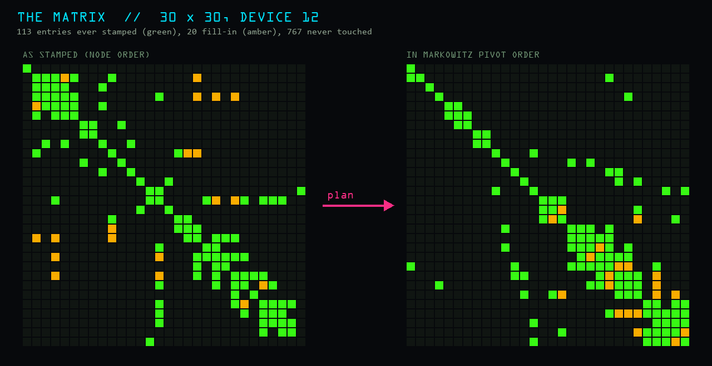</p>

### 3 · Catching a multivibrator's switching edge

A multivibrator's flip is a mode that grows at around 10⁹ s⁻¹ through the junction capacitances.
Backward Euler at an audio step damps such a mode instead of following it, and the circuit parks
on the unstable balance between its two states, which is why every astable was silent at first.
The fix reads a number the LU factorisation already has. The determinant of the step matrix is a
product over the circuit's natural frequencies,

$$ \det\!\left(G + \tfrac{C}{h}\right) \;\propto\; \prod_{\lambda}\left(\tfrac{1}{h} - \lambda\right), $$

so its **sign flips exactly when a real mode grows faster than the step can follow** (*hλ > 1*).
A trial solve that meets such a matrix, fails to converge in 10 iterations, or bends a junction's
slope too sharply is abandoned. The step is then covered in substeps that dive towards
picoseconds through the edge and climb back out.

<p align="center">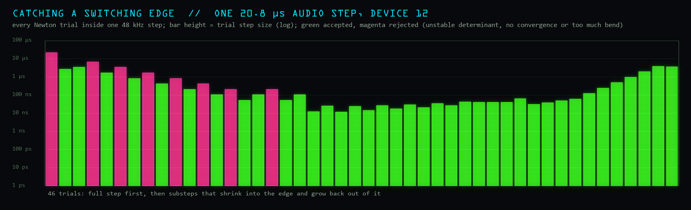</p>

The pitch then holds still across sample rates: device 12 gives 405–413 Hz at 24, 48 and 96 kHz.
The cost is about 40 substeps and 170 solves per edge, whatever the rate.

### 4 · Two clocks for radio frequency

The antenna oscillators run at **290–970 kHz**, a hundred times faster than the audio clock. The
emulator solves them on two time scales at once.

**Envelope, most of the time.** The antenna's tank is treated as one resonant mode. An AC solve of
the real network gives its frequency, shape, stored energy *w* and losses *G*. Each junction under
a sinusoidal swing is summarised by its **describing function**,

$$ e^{(V_0 + aV_T\cos\theta)/V_T} = e^{V_0/V_T}\big(I_0(a) + 2I_1(a)\cos\theta + \dots\big), $$

which gives the power the transistor feeds the tank, *p(A)*, and the rectified current that drags
the audio-rate bias. The amplitude then obeys an energy balance, solved implicitly every audio
step with a bracketed search that holds ln *A* through each circuit solve:

$$ \frac{d\ln A}{dt} = -\,\frac{p(A) + G/2}{2w} $$

**Burst transient, when it squegs.** Once the swing gets violent, averaging breaks: the tank
overshoots and dumps its energy into the base capacitor within a cycle or two. The RF part of the
circuit alone is then integrated as a true transient, **BDF2 at 32 steps per cycle**, with the
quiet rails held:

$$ i_C = \frac{C}{2h}\left(3v_{n+1} - 4v_n + v_{n-1}\right) $$

Its junction currents, averaged over one RF cycle, flow into the audio solve. When the tank rings
down, the envelope takes over again. A steady oscillation is handed back to the envelope too, with
a 24-cycle look-ahead every 50 ms in case it starts to squeg.

<p align="center">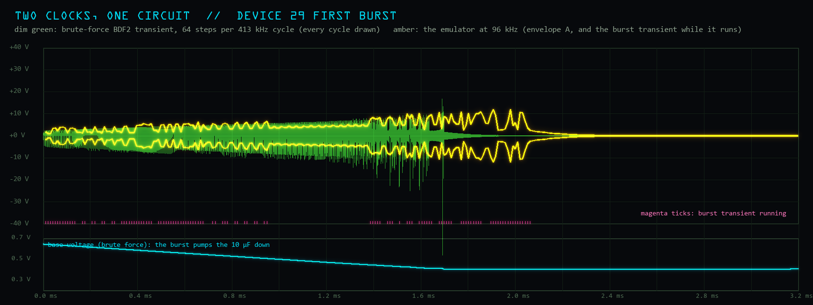</p>

The chart compares the two against a brute-force transient of the whole circuit. They are not
the same waveform, and are not meant to be. What the ear gets, the burst rate and the charge each
burst pumps out of the base, is what gets checked. Device 24 squegs every 2.19–2.20 ms at 24, 48
and 96 kHz against about 2.2 ms by brute force, and device 29 ticks every 85–100 ms against 78–85 ms.

### 5 · Keeping up with the sound card

The solver lives in an **AudioWorklet**. Before a new circuit plays, the engine times it at 48,
24, 12 and 6 kHz, with the key up and with it held, and picks the fastest rate with 3× headroom,
interpolating up to the device rate. It stops lowering the rate once halving it no longer saves
time, because switching edges cost the same at any rate. The worklet reports how fast it renders
against the clock, and the status line says so plainly when it falls behind: «не успевает: 53 %».
Pressing the key or turning a knob only changes element values, so the running simulation takes
them in place and **capacitors keep their charge**, which is what makes a time relay possible.

---

## B3 · Power meter: the token budget

The emulator, its reverse engineering and its documentation came out of **one long Claude Code
session**. The counts below come from that session's own transcript and cover the work up to this
README, including rendering its artwork.

<p align="center">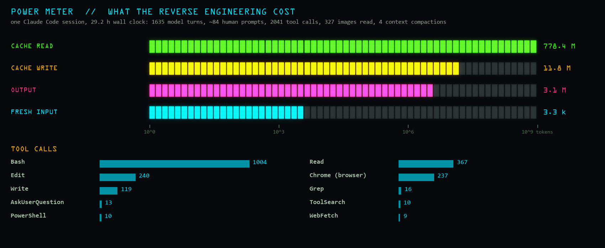</p>

| Meter | Reading |
|---|---|
| Wall clock | 29.2 h, 12–13 Sep 2026 |
| Model turns | 1,635 (Claude Opus 5, with some Sonnet 5) |
| Human prompts | ~84 |
| Tool calls | 2,041, of which 1,004 shell · 367 file reads · 359 edits and writes · 237 browser actions |
| Images examined | 327: manual pages, zoomed cells, emulator screenshots |
| Context compactions | 4 |
| Output tokens | **3.1 M**: code, docs, tests, and the reasoning around them |
| Fresh input tokens | 3.3 k |
| Cache writes | 11.8 M |
| Cache reads | **778 M** |

**Reading the meter.** Almost everything is **cache reads**: each turn re-reads the growing
conversation (instructions, code, earlier results) from the prompt cache instead of paying for it
fresh. Output is what was actually written. For scale, the repository holds about 7,900 lines of
TypeScript in `src/`, 1,700 lines of tests and 900 lines of spec, plan and open-problems notes.
Images are a real line item: this project is read off scans, so looking was most of the work.

---

## B4 · Known glitches

Written down in full in [`UNSOLVED.md`](UNSOLVED.md):

- **Fast multivibrators outrun the browser.** Device 6 plays at about a third of real time in
  Chrome, device 15 at about half. Their edges are correct but expensive.
- **The metronome needs 24 kHz**, and the browser's benchmark gives it 12 kHz, where its ticks
  come several times too slowly. Its tick rate also swings far more with the tuning knob than the
  manual's "small limits".
- **The radio block is the one behavioural part.** Real carriers at 0.15–1.6 MHz are replaced by
  fictional stations injected into the antenna's coupling winding. That injection still leaks
  into the oscillator presets, and still assumes C10 spans the whole coil.
- **Device 26's moisture probe** has no model yet: the leads are plain wires.

---

## B5 · Repository map and sources

```text
src/
  model/      board, panel geometry (mm), module catalogue generated from the registry, antenna
  netlist/    contacts → nets by union-find, the built-in amplifier transistor by transistor
  sim/        mna.ts (steps, Newton, substeps) · matrix.ts (sparse plan LU) · rf.ts (envelope)
              burst.ts (RF transient) · models.ts (Ebers–Moll, Shockley) · radio.ts (stations)
  audio/      engine.ts (rate benchmark, pace) · solver-worklet.ts · clicks.ts (synthesized clicks)
  ui/         panel-canvas.ts · probe.ts (scope) · skins/ (grey, black, schematic)
  circuits/   the presets, one commented cell per line
assets/
  blocks/             block_spec.json: 26 module types, confirmed pinouts, icon crops, recipe
  core/               Приложение 3: the built-in amplifier's schematic and parts list
  circuitry-legend/   Приложение 1: the manual's symbol legend
  multivibrator-*.png device 6's mounting drawing and schematic, the first layout traced
  the-original-econ-01-body.jpg   the square-on photograph the panel is measured from
docs/readme/     this README's images, GIFs and sound samples
test/            solver, netlist, schematic matcher, preset behaviour and timing
SPEC.md          the reverse-engineered device, every claim tagged [C] [I] [G]
DEVPLAN.md       phases, decisions, what was tried and why it failed
UNSOLVED.md      what does not work yet
```

**Sources.** The factory manual «Электронный конструктор ЭКОН-01. Руководство по эксплуатации»
(ВНИИ «Электронстандарт», 1986), scanned at [retropc.org](http://retropc.org/Elektronnyj_konstruktor_Ekon-01_s_59.html);
photographs from retropc.org and [sovtech.su](https://www.sovtech.su/2024/11/30/); history from
rw6ase.narod.ru, rdwiki.com and radionic.ru. The full manual and most photographs stay out of the
repository. What is kept under `assets/` is the reference material the models are built from and
this README shows: crops of the parts table, Приложения 1 and 3, and device 6's page, plus one
photograph of a grey unit, which carries the watermark of the site it was published on.

```text
 ──────────────────────────────────────────────────────────────────────────────────
  КОНЕЦ ПЛЁНКИ · END OF TAPE                               ◄◄  REWIND   ■ STOP
```
